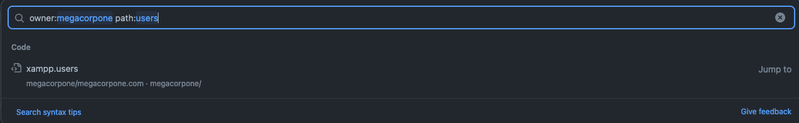

# Passive information gathering

## Whois enumeration

```
whois megacorpone.com -h 192.168.50.251
whois 38.100.193.70 -h 192.168.50.251
```

## Google hacking

## Netcraft

```
https://searchdns.netcraft.com
```

## Open-source code

Searching online source code repositories like Github, GutHub Gist, GitLab and SourceForge.

<figure><figcaption><p>Searching on a github repo</p></figcaption></figure>

For larger repos we can use tools to automate some of the searching: [Gitrob ](https://github.com/michenriksen/gitrob)and [Gitleaks](https://github.com/zricethezav/gitleaks)

<figure><figcaption><p>Example Gitleaks output</p></figcaption></figure>

## Shodan

```
hostname: megacorpone.com
domain: megacorpone.com
```

## Security Headers and SSL/TLS




